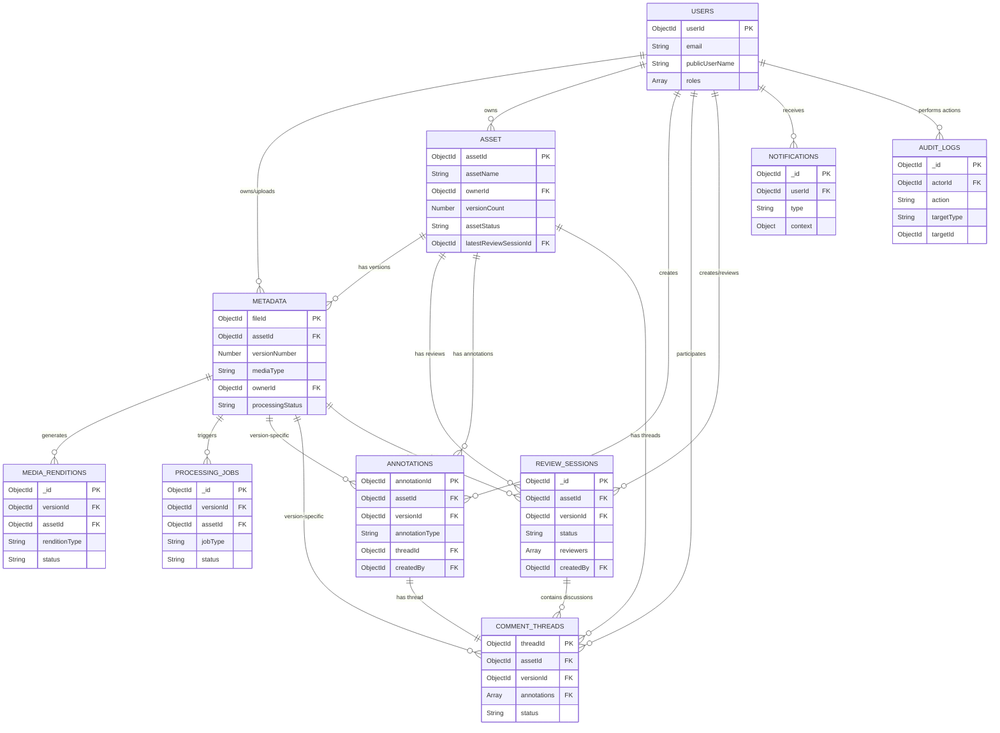

# Database Design - Media Review Platform

## 1. Tổng quan

Thiết kế database cho hệ thống Media Review Platform dựa trên MongoDB, kế thừa từ hệ thống File Sharing cũ và mở rộng để hỗ trợ đầy đủ các tính năng review media chuyên nghiệp.

### 1.1 Nguyên tắc thiết kế
1. **Kế thừa hợp lý**: Giữ nguyên collections đã ổn định (user), mở rộng/tái cấu trúc metadata thành media_assets + media_versions
2. **Denormalization có kiểm soát**: Embed dữ liệu khi access pattern rõ ràng (annotation → region/timecode), reference khi cần truy vấn độc lập
3. **Version-centric**: Mọi annotation, comment đều gắn với versionId cụ thể để tránh nhầm lẫn khi có nhiều phiên bản
4. **Audit-ready**: Các action quan trọng đều có timestamp và actor để phục vụ audit trail

### 1.2 Danh sách Collections

| Collection | Mô tả | Kế thừa từ Phase 1 |
|------------|-------|-----------------|
| `users` | Thông tin người dùng | Giữ nguyên |
| `media_assets` | Media asset (video/image) | Mở rộng từ metadata |
| `media_versions` | Các phiên bản của asset |  Mới |
| `media_renditions` | Các rendition (HLS profiles) | Mới |
| `annotations` | Đánh dấu/comment theo vị trí | Mới |
| `comment_threads` | Luồng comment và replies | Mới |
| `review_sessions` | Phiên review với workflow |  Mới |
| `processing_jobs` | Job queue cho media processing |Mới |
| `audit_logs` | Lịch sử thao tác quan trọng | Mới |
| `notifications` | Thông báo cho người dùng | Mới |

---

## 2. Chi tiết Collections

### 2.1 Collection: `users`

**Mục đích**: Quản lý thông tin người dùng, xác thực và phân quyền hệ thống.

**Kế thừa**: Giữ nguyên từ Phase 1, bổ sung một số field cho notification preferences.

```javascript
{
  "userId": ObjectId,  
  "email": String,  
  "password": String,   
  "publicUserName": String,  
  "roles": ["USER", "ADMIN"], 
  "enabled": Boolean,    
  "emailVerified": Boolean,  
  
  // OAuth providers
  "providers": [
    {
      "provider": "LOCAL" | "GOOGLE",
      "providerId": String,  
      "linkedAt": ISODate
    }
  ],
  "metadata": {
    "avatar": String,   
    "locale": String,     
    "timezone": String 
  }, // luu gi thi luu, thuong la luu avt image

  // references
  "notificationPreferences": {
    "emailOnNewComment": Boolean, 
    "emailOnMention": Boolean,   
    "emailOnStatusChange": Boolean, 
    "inAppNotifications": Boolean  
  },
  "createdAt": ISODate,
  "updatedAt": ISODate,
  "lastLoginAt": ISODate
}
```

**Indexes**:
```javascript
{"email" = 1}, 
{"providers.provider" = 1, "providers.providerId" = 1}
```

---

### 2.2 Collection: `metadata`

**Mục đích**: Đại diện cho một media item (video/image), quản lý metadata tổng quan và permissions, version của asset.

**Chuyển đổi từ Phase 1**: thêm thông tin về asset, version-specific.

```javascript
{
  "fileId": ObjectId,
  "fileName": String,  // tên file được upload
  "objectName": String,
  "projectId": ObjectId,  
  "folderId": ObjectId,

  "assetId": ObjectId, // asset quản lý media

  // dành cho trải nghiệm khách hàng
  "downloadFileName": String, // use case: khi producer upload asset lên thì dựa vào version và tên dự án sẽ đặt tên cho file download. người dùng cần download về thì sẽ nhận được file với tên này.

  // version
  "versionNumber": Number, 

  "description": String, // new
  "mediaType": "VIDEO" | "IMAGE" | "DESIGN", // new
  "mimeType": String,

  "fileSize": Number, // double
  "compressionAlgo": String, // check lai co can khong, khong thi bo qua 

  // danh cho upload
  "uploadId": String,
  "status": "UPLOADING", "COMPLETED", "FAILED"

  // rieng cho video
  "processingStatus": "PENDING" | "PROCESSING" | "READY" | "FAILED",
  "processingError": String,  
  "processingStartedAt": ISODate,
  "processingCompletedAt": ISODate,
  "mediaInfo": {
    "durationMs": Number,      // video  
    "width": Number, // do phan giai
    "height": Number,
    "frameRate": Number, 
    "codec": String,      
    "bitrate": Number,  
    
    "colorSpace": String,
    "hasAlpha": Boolean 
  },
  
  "ownerId": ObjectId,  
  "ownerEmail": String,  
  
  "visibility": "PRIVATE" | "PUBLIC",
  "publicPermission": "READ" | "COMMENT" | "MODIFY",
  "userPermissions": [
    {
      "userId": ObjectId,
      "email": String,
      "permissions": ["READ", "COMMENT", "MODIFY"]
    }
  ],
  "publishUserPermission": "PUBLIC", "READ", "COMMENT", "MODIFY", "OWNER"
  
  "timeToLive": Number,
  "isActive": Boolean,   // xoa mềm
  "isTrash": Boolean,  
  "trashedAt": ISODate, 
  
  "renditionCount": Number, // số lượng các rendition cần render, ví dụ như thumbnail, hls,...
  
  "createdAt": ISODate,
  "updatedAt": ISODate
}
```

**Indexes**:
```javascript
{ "ownerId"=1, "isTrash" = 1, "createdAt" = -1 } // createAt sort 
{ "objectName" = 1},
{ "folderId": 1, "objectName": 1 },
{ "projectId": 1, "folderId": 1 },
{ "projectId": 1, "objectName": 1 },
{ "shareToken" = 1 } 
{ "visibility" = 1, "publicPermission" = 1} ,
{ "userPermissions.userId" = 1 } ,
{ "latestReviewStatus" = 1 }  ,
{ "assetId" = 1, "versionNumber" = 1}
```

**Constrain**
* mongo tự xoá các bản ghi có isActive = false quá 30 ngày

---

### 2.3 Collection: `asset`

**Mục đích**: Lưu thông tin của một asset. asset sẽ lưu thông tin của media, các phiên bản,...

```javascript
{
  "assetId": ObjectId,
  "assetName": String, // init ban đầu là fileName của lần đầu upload, user có thể sửa
  "description": String,

  "ownerId": ObjectId,  
  "ownerEmail": String,

  "versionCount": Number,

  "assetStatus": "DRAFT" | "IN_REVIEW" | "APPROVED" | "REQUEST_CHANGES",
  "latestReviewSessionId": ObjectId,

  // share token đi kèm với asset thay vì metadata, có sharetoken thì access được vào tất cả phiên bản
  "shareToken": String, 
  "shareExpiry": ISODate,  // new

  "createdAt": ISODate,
  "updatedAt": ISODate
}
```

---

### 2.4 Collection: `media_renditions`

**Mục đích**: Lưu thông tin các bản rendition (HLS profiles, thumbnails) được tạo từ FFmpeg.

```javascript
{
  "_id": ObjectId,  
  "versionId": ObjectId,       
  "assetId": ObjectId,   // co asset va version se lay duoc file         
  
  "renditionType": "HLS" | "THUMBNAIL" | "SPRITE" | "WAVEFORM" | "POSTER",
  
  // HLS specific
  "profile": String,          
  "manifestKey": String,       
  "segmentPathPrefix": String,  
  "bandwidth": Number,            
  "resolution": {
    "width": Number,
    "height": Number
  },
  
  // Thumbnail/Sprite specific
  "thumbnailCount": Number,  // số thumbnail trong sprite
  "intervalMs": Number,  // khoảng cách giữa các thumbnail
  "spriteKey": String, // vi du thumbnails/{assetId}/{versionId}/sprite.jpg
  "spriteMetadataKey": String,  // thumbnails/{assetId}/{versionId}/sprite.vtt
  
  // Poster spec
  "posterKey": String,   // thumbnails/{assetId}/{versionId}/poster.jpg
  "posterTimestamp": Number,   // ms - vị trí lấy poster
  
  "fileSize": Number,     // bytes
  "status": "PENDING" | "PROCESSING" | "READY" | "FAILED",
  
  "createdAt": ISODate,
  "updatedAt": ISODate
}
```

**Indexes**:
```javascript
{ "versionId": 1, "renditionType": 1 }      
{ "assetId": 1 }    
{ "status": 1 }                                   // processing queue
```

---

### 2.5 Collection: `annotations`

**Mục đích**: Đánh dấu vị trí trên video (timecode) hoặc vùng trên image để gắn comment.

```javascript
{
  "annotationId": ObjectId,                    // id mongo
  "assetId": ObjectId,                // ref → media_assets
  "versionId": ObjectId,              // ref → media_versions (quan trọng!)
  
  "annotationType": "TIMECODE" | "REGION" | "FRAME_REGION",
  
  // Timecode annotation (video)
  "timecode": {
    "startMs": Number,                // mốc bắt đầu (ms)
    "endMs": Number                   // mốc kết thúc (ms), có thể = startMs nếu point
  },
  
  // Region annotation (image hoặc video frame)
  "region": {
    "shape": "RECTANGLE" | "CIRCLE" | "POLYGON" | "FREEFORM",
    // Normalized coordinates (0-1) để responsive với kích thước viewport
    "points": [
      { "x": Number, "y": Number }    // RECTANGLE: 2 điểm (topLeft, bottomRight)
    ],                                // POLYGON: n điểm
                                      // CIRCLE: center + radius point
    "strokeColor": String,            // #FF0000
    "strokeWidth": Number,            // px
    "fillColor": String               // rgba(255,0,0,0.2)
  },
  
  // Frame-specific region (video frame annotation)
  "frameNumber": Number,              // frame cụ thể (optional, dùng với FRAME_REGION)
  
  // Status
  "status": "OPEN" | "RESOLVED",
  "resolvedAt": ISODate,
  "resolvedBy": ObjectId,             // ref → users
  
  // Thread reference
  "threadId": ObjectId,               // ref → comment_threads: luồng comment
  
  // Creator
  "createdBy": ObjectId,              // ref → users
  "createdByEmail": String,           // denormalized
  
  "createdAt": ISODate,
  "updatedAt": ISODate
}
```

**Indexes**:
```javascript
{ "versionId": 1, "createdAt": -1 }               // list annotations of version
{ "assetId": 1, "versionId": 1 }                  // cross-version query
{ "versionId": 1, "status": 1 }                   // filter by status
{ "versionId": 1, "timecode.startMs": 1 }         // timeline ordering
{ "threadId": 1 }                                 // lookup by thread
{ "createdBy": 1 }                                // user's annotations
```

---

### 2.6 Collection: `comment_threads`

**Mục đích**: Quản lý luồng comment với replies, hỗ trợ threaded discussion.

```javascript
{
  "threadId": ObjectId,                    // mongo id
  "assetId": ObjectId,                // ref → asset
  "version": Number,             
  "annotations": [ObjectId],           // có thể nhiều annotation trong một comment (thường trường hợp này sẽ rơi vào ảnh nhiều hơn, video thường ít), ref → annotations (nullable nếu general comment)
  
  // Root comment
  "rootComment": {
    "commentId": ObjectId,            // unique ID cho comment
    "content": String,                // nội dung text (có thể chứa @mentions)
    "mentions": [ObjectId],           // danh sách userId được mention
    "attachments": [                  // file đính kèm (optional)
      {
        "type": "IMAGE" | "FILE",
        "fileId": String,
        "fileName": String,
        "fileSize": Number
      }
    ],
    "createdBy": ObjectId,
    "createdByEmail": String,         // denormalized
    "createdByName": String,          // denormalized
    "createdAt": ISODate,
    "editedAt": ISODate               // null nếu chưa edit
  },
  
  // Replies
  // mặc định tất cả các reply đều nhỏ cấp hơn so với rootComment
  "replies": [
    {
      "commentId": ObjectId,
      "replyToComment": ObjectId, // id của comment được trả lời
      "content": String,
      "mentions": [ObjectId],
      "attachments": [],
      "createdBy": ObjectId,
      "createdByEmail": String,
      "createdByName": String,
      "createdAt": ISODate,
      "editedAt": ISODate
    }
  ],
  
  // Thread metadata
  "replyCount": Number,               // cached count
  "participants": [ObjectId],         // unique users in thread
  "lastActivityAt": ISODate,          // thời điểm hoạt động cuối
  
  // Status (sync với annotation nếu có)
  "status": "OPEN" | "RESOLVED",
  "resolvedAt": ISODate,
  "resolvedBy": ObjectId,
  
  "createdAt": ISODate,
  "updatedAt": ISODate
}
```

**Indexes**:
```javascript
{ "versionId": 1, "lastActivityAt": -1 }          // recent threads
{ "assetId": 1, "versionId": 1 }                  // cross-version
{ "annotations": 1 }                              // lookup by annotation (array field)
{ "participants": 1 }                             // threads user participated
{ "status": 1 }                                   // filter resolved/open
{ "rootComment.mentions": 1 }                     // find by mention
```

---

### 2.7 Collection: `review_sessions`

**Mục đích**: Quản lý phiên review với workflow status, tracking người review.

```javascript
{
  "_id": ObjectId,                    // reviewSessionId
  "assetId": ObjectId,                // ref → asset
  "versionId": ObjectId,              // ref → metadata (version đang review)
  
  // Review info
  "title": String,                    // tên phiên review
  "description": String,              // mô tả/notes
  "dueDate": ISODate,                 // deadline (optional)
  
  // Workflow status
  "status": "DRAFT" | "IN_REVIEW" | "REQUEST_CHANGES" | "APPROVED",
  "statusHistory": [
    {
      "status": String,
      "changedBy": ObjectId,
      "changedByEmail": String,
      "changedAt": ISODate,
      "note": String                  // lý do thay đổi (optional)
    }
  ],
  
  // Reviewers
  "reviewers": [
    {
      "userId": ObjectId,
      "email": String,
      "role": "REVIEWER" | "APPROVER",  // APPROVER có quyền chuyển APPROVED
      "invitedAt": ISODate,
      "lastViewedAt": ISODate,        // tracking engagement
      "hasCommented": Boolean         // đã comment chưa
    }
  ],
  
  // Metrics (denormalized)
  "metrics": {
    "totalAnnotations": Number,
    "openAnnotations": Number,
    "resolvedAnnotations": Number,
    "totalComments": Number
  },
  
  // Creator
  "createdBy": ObjectId,
  "createdByEmail": String,
  
  "createdAt": ISODate,
  "updatedAt": ISODate,
  "completedAt": ISODate              // khi status = APPROVED
}
```

**Indexes**:
```javascript
{ "assetId": 1, "createdAt": -1 }                 // list sessions of asset
{ "status": 1, "dueDate": 1 }                     // deadline tracking with status filter
{ "reviewers.userId": 1, "status": 1 }            // sessions user is reviewing (active)
{ "dueDate": 1 }                                  // upcoming deadlines
{ "createdBy": 1, "status": 1 }                   // user's sessions by status
{ "versionId": 1 }                                // lookup reviews by version
```

---

### 2.8 Collection: `processing_jobs`

**Mục đích**: Queue cho media processing jobs (transcode, thumbnail generation).

```javascript
{
  "_id": ObjectId,                    // jobId
  "versionId": ObjectId,              // ref → media_versions
  "assetId": ObjectId,                // denormalized
  
  "jobType": "TRANSCODE_HLS" | "GENERATE_THUMBNAILS" | "GENERATE_SPRITE" | 
             "GENERATE_POSTER" | "GENERATE_WAVEFORM" | "VIRUS_SCAN",
  
  // Job config
  "config": {
    // Transcode specific
    "profiles": ["360p", "720p", "1080p"],
    
    // Thumbnail specific
    "intervalSeconds": Number,
    "maxThumbnails": Number,
    
    // Virus scan specific
    "scanEngine": String
  },
  
  // Status
  "status": "PENDING" | "PROCESSING" | "COMPLETED" | "FAILED" | "CANCELLED",
  "priority": Number,                 // 1 (highest) - 10 (lowest)
  
  // Progress
  "progress": {
    "percent": Number,                // 0-100
    "currentStep": String,            // "Encoding 720p..."
    "estimatedTimeRemainingMs": Number
  },
  
  // Result
  "result": {
    "success": Boolean,
    "outputKeys": [String],           // MinIO keys của output
    "errorMessage": String,
    "errorDetails": Object
  },
  
  // Timing
  "scheduledAt": ISODate,
  "startedAt": ISODate,
  "completedAt": ISODate,
  
  // Retry
  "retryCount": Number,               // default: 0
  "maxRetries": Number,               // default: 3
  "lastError": String,
  
  // Worker info
  "workerId": String,                 // ID của worker đang xử lý
  "workerHeartbeat": ISODate,         // heartbeat để detect stuck jobs
  
  "createdAt": ISODate,
  "updatedAt": ISODate
}
```

**Indexes**:
```javascript
{ "status": 1, "priority": 1, "scheduledAt": 1 }  // job queue query
{ "versionId": 1 }                                // jobs của version
{ "workerId": 1, "status": 1 }                    // worker's jobs
{ "workerHeartbeat": 1 }                          // detect stuck jobs
{ "createdAt": 1 }                                // TTL index for cleanup
```

---

### 2.9 Collection: `audit_logs`

**Mục đích**: Ghi lại các action quan trọng để truy vết và compliance.

```javascript
{
  "_id": ObjectId,                    // logId
  
  // Actor
  "actorId": ObjectId,                // ref → users (null nếu system)
  "actorEmail": String,
  "actorType": "USER" | "SYSTEM" | "API_KEY",
  
  // Action
  "action": "CREATE" | "UPDATE" | "DELETE" | "STATUS_CHANGE" | 
            "PERMISSION_CHANGE" | "LOGIN" | "LOGOUT" | "SHARE" | 
            "DOWNLOAD" | "UPLOAD_COMPLETE",
  
  // Target
  "targetType": "FILE" | "ASSET" | "ANNOTATION" | 
                "COMMENT" | "REVIEW_SESSION" | "USER" | "PERMISSION",
  "targetId": ObjectId,
  "targetName": String,               // human-readable name
  
  // Context
  "assetId": ObjectId,                // nullable, cho query theo asset
  "versionId": ObjectId,              // nullable
  "reviewSessionId": ObjectId,        // nullable
  
  // Change details
  "changes": {
    "before": Object,                 // state trước
    "after": Object                   // state sau
  },
  
  // Request metadata
  "requestInfo": {
    "ipAddress": String,
    "userAgent": String,
    "requestId": String               // correlation ID
  },
  
  "timestamp": ISODate,
  "expiresAt": ISODate                // TTL cho auto-cleanup (optional)
}
```

**Indexes**:
```javascript
{ "actorId": 1, "timestamp": -1 }                 // user's actions
{ "targetType": 1, "targetId": 1, "timestamp": -1 } // target history
{ "assetId": 1, "timestamp": -1 }                 // asset audit trail
{ "action": 1, "timestamp": -1 }                  // filter by action type
{ "timestamp": -1 }                               // recent logs
{ "expiresAt": 1 }                                // TTL index
```

---

### 2.10 Collection: `notifications`

**Mục đích**: Lưu trữ thông báo cho người dùng (in-app notifications).

```javascript
{
  "_id": ObjectId,                    // notificationId
  "userId": ObjectId,                 // ref → users (recipient)
  
  "type": "NEW_COMMENT" | "MENTION" | "STATUS_CHANGE" | "NEW_VERSION" | 
          "REVIEW_INVITATION" | "ANNOTATION_RESOLVED" | "DEADLINE_REMINDER",
  
  // Content
  "title": String,                    // tiêu đề ngắn
  "message": String,                  // nội dung chi tiết
  "link": String,                     // deep link đến resource
  
  // Context
  "context": {
    "assetId": ObjectId,
    "assetName": String,
    "versionId": ObjectId,
    "annotationId": ObjectId,
    "commentId": ObjectId,
    "reviewSessionId": ObjectId,
    "actorId": ObjectId,              // người tạo action
    "actorName": String
  },
  
  // Status
  "isRead": Boolean,                  // default: false
  "readAt": ISODate,
  
  // Delivery status (for multi-channel)
  "deliveryStatus": {
    "inApp": "DELIVERED",
    "email": "PENDING" | "SENT" | "FAILED" | "SKIPPED"
  },
  
  "createdAt": ISODate,
  "expiresAt": ISODate                // TTL
}
```

**Indexes**:
```javascript
{ "userId": 1, "isRead": 1, "createdAt": -1 }     // unread notifications
{ "userId": 1, "createdAt": -1 }                  // all notifications
{ "expiresAt": 1 }                                // TTL index
{ "deliveryStatus.email": 1 }                     // email queue
```

---

## 3. Quan hệ giữa các Collections



**Giải thích mối quan hệ chính:**
- `ASSET` là đơn vị trung tâm, chứa nhiều `METADATA` versions
- `METADATA` (version) được annotate, comment và review độc lập
- `ANNOTATIONS` và `COMMENT_THREADS` luôn gắn với version cụ thể (`versionId`)
- `REVIEW_SESSIONS` tham chiếu đến version đang được review
- Denormalization: email, name được duplicate để tránh joins
- One-to-many relationships chủ yếu sử dụng ObjectId references

---

## 6. Performance Considerations

### 6.1 Denormalization Strategy
- **Email/Name**: Duplicate vào documents thường xuyên hiển thị để tránh joins
- **Counts**: Cache `replyCount`, `versionCount`, `annotationCount` và update via `$inc`
- **Latest Status**: `latestReviewStatus` trên asset để filter nhanh

### 6.2 Index Recommendations
- Compound indexes cho common query patterns
- Partial indexes cho sparse fields (e.g., `trashedAt` chỉ index khi not null)
- TTL indexes cho audit_logs và notifications

### 6.3 Sharding Considerations (future)
- Shard key candidate: `ownerId` hoặc `assetId`
- Cân nhắc khi vượt 100GB data hoặc 10K requests/sec

---

## 7. Data Validation Rules

### 7.1 Required Fields per Collection
- **metadata**: name, mediaType, ownerId, visibility
- **media_versions**: assetId, versionNumber, objectName, mimeType
- **annotations**: assetId, versionId, annotationType, createdBy
- **comment_threads**: assetId, versionId, rootComment
- **review_sessions**: assetId, activeVersionId, status

### 7.2 Enum Constraints
```javascript
// mediaType (metadata, asset)
["VIDEO", "IMAGE", "DESIGN"]

// processingStatus (metadata)
["PENDING", "PROCESSING", "READY", "FAILED"]

// uploadStatus (metadata)
["UPLOADING", "COMPLETED", "FAILED"]

// visibility (metadata, asset)
["PRIVATE", "PUBLIC"]

// publicPermission (metadata)
["READ", "COMMENT", "MODIFY"]

// publishUserPermission (metadata)
["PUBLIC", "READ", "COMMENT", "MODIFY", "OWNER"]

// assetStatus (asset)
["DRAFT", "IN_REVIEW", "APPROVED", "REQUEST_CHANGES"]

// reviewSessionStatus (review_sessions)
["DRAFT", "IN_REVIEW", "REQUEST_CHANGES", "APPROVED"]

// annotationType (annotations)
["TIMECODE", "REGION", "FRAME_REGION"]

// annotationStatus (annotations)
["OPEN", "RESOLVED"]

// regionShape (annotations.region)
["RECTANGLE", "CIRCLE", "POLYGON", "FREEFORM"]

// threadStatus (comment_threads)
["OPEN", "RESOLVED"]

// reviewerRole (review_sessions.reviewers)
["REVIEWER", "APPROVER"]

// renditionType (media_renditions)
["HLS", "THUMBNAIL", "SPRITE", "WAVEFORM", "POSTER"]

// renditionStatus (media_renditions)
["PENDING", "PROCESSING", "READY", "FAILED"]

// jobType (processing_jobs)
["TRANSCODE_HLS", "GENERATE_THUMBNAILS", "GENERATE_SPRITE", "GENERATE_POSTER", "GENERATE_WAVEFORM", "VIRUS_SCAN"]

// jobStatus (processing_jobs)
["PENDING", "PROCESSING", "COMPLETED", "FAILED", "CANCELLED"]

// auditAction (audit_logs)
["CREATE", "UPDATE", "DELETE", "STATUS_CHANGE", "PERMISSION_CHANGE", "LOGIN", "LOGOUT", "SHARE", "DOWNLOAD", "UPLOAD_COMPLETE"]

// targetType (audit_logs)
["FILE", "ASSET", "ANNOTATION", "COMMENT", "REVIEW_SESSION", "USER", "PERMISSION"]

// actorType (audit_logs)
["USER", "SYSTEM", "API_KEY"]

// notificationType (notifications)
["NEW_COMMENT", "MENTION", "STATUS_CHANGE", "NEW_VERSION", "REVIEW_INVITATION", "ANNOTATION_RESOLVED", "DEADLINE_REMINDER"]

// deliveryStatus (notifications)
["PENDING", "SENT", "FAILED", "SKIPPED", "DELIVERED"]

// userRoles (users)
["USER", "ADMIN"]

// providers (users)
["LOCAL", "GOOGLE"]

// permissions (metadata.userPermissions)
["READ", "COMMENT", "MODIFY"]
```
